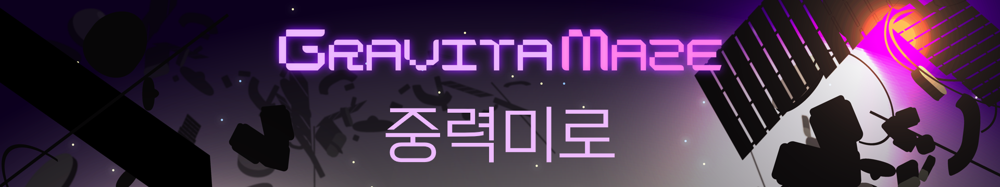
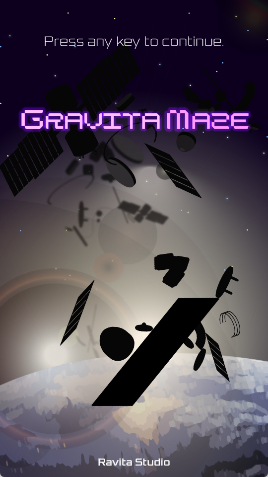
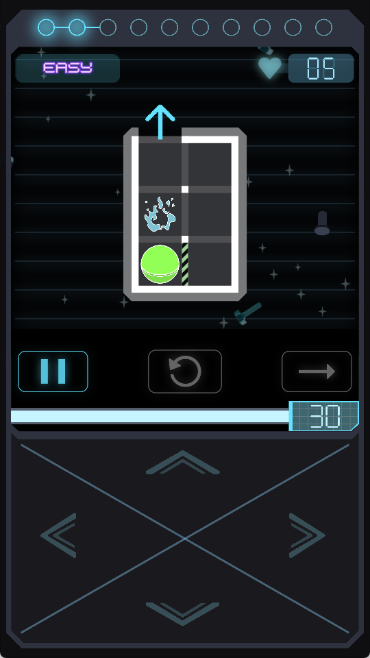

# 중력미로

**[한국어로 읽기](./README.ko.md)**  
**[Read in English](./README.md)**

  

## 게임 소개

### "중력을 조작하여 짧은 시간 안에 미로를 빠져나가자!"

* 퍼즐 게임
* 우주선 편집기로 나만의 맵을 만들어볼 수 있습니다!
* 한국어 지원!
  * 영어는 일시적으로 지원되지 않습니다.
* 이 버전은 출시 전 데모 버전입니다.
  * 출시 등의 최신 소식은 [블로그](https://blog.naver.com/ravitastudio)에서 확인하세요.
* 중력미로의 최신 소식은 아래에서 확인하세요!
  * 유튜브: https://youtube.com/@Ravita_Studio/
  * 네이버 블로그: https://blog.naver.com/ravitastudio (한국어 전용)

## 다운로드

### [v1.6.4 for Android, Windows, and macOS](https://github.com/salt26/gravita-maze/releases/tag/v1.6.4)

> 공지: 이 데모 버전은 2023년 12월까지만 플레이하실 수 있습니다.

---

## 업데이트 로그

여기를 클릭하면 과거 업데이트 내용을 표시하거나 숨길 수 있습니다.

### 업데이트 (v1.5.0 -> v1.6.4)

#### 그래픽
* 완전히 새로워진 그래픽 적용!

#### 사용자 인터페이스
* 중력 조작 대신 마우스 클릭을 통해 선택하도록 메인 메뉴 개편
  * 어드벤처 -> 도전(Challenge)
  * 커스텀 -> 탐험(Explore)
  * 맵 편집기 -> 창작(Create)
  * 설정 -> (일시적으로 사용 불가)
  * 크레딧 -> (일시적으로 사용 불가)
* 명칭 변경
  * 맵 -> 우주선
  * 공 -> 캡슐
  * 맵 편집기 -> 우주선 제작소
* 도전 모드에 새로운 난도 추가
  * Easy < **Simple** < Normal < Hard < **Extreme** < Insane
* 도전 모드 플레이 중에 현재 도전하고 있는 난도 표시
* 첫 플레이 유저를 위한 화면 제거
* 스플래시 화면 추가
  * 네트워크를 통해 서버와 연결할 수 없는 경우 게임 플레이를 할 수 없으며 대신 블로그와 유튜브 링크를 표시함
* 창작 모드에서 우주선을 열 때 구멍과 관련하여 생기던 버그 수정
* 창작 모드에서 우주선을 저장할 때 제작자 이름을 적도록 함
* 창작 모드의 테스트 페이즈에서 항상 되돌리기 대신 시간 되돌리기가 되도록 함
* 애플리케이션이 포커스를 잃을 때 자동으로 게임이 일시정지됨
* 한국어로만 표시
  * 영어는 일시적으로 지원되지 않음

#### 게임 밸런스
* 도전 모드에서 새 난도 분류 체계에 따라 밸런스 조정
  * 새 Easy는 옛 Easy보다 쉬운 난도
  * 새 Simple은 옛 Easy와 비슷한 난도
  * 새 Normal은 옛 Normal 중 비교적 쉬운 우주선만을 모은 난도
  * 새 Hard는 옛 Normal 중 비교적 어려운 우주선과 옛 Hard 중 비교적 쉬운 우주선을 모은 난도
  * 새 Extreme은 옛 Hard보다 조금 어려운 난도
  * 새 Insane은 옛 Insane과 비슷한 난도
* 새 우주선 다수 추가

### 업데이트 (v1.4.4 -> v1.5.0)

* 중력 조작의 느낌을 잘 보여주는 입자 애니메이션 추가
* 구멍 뚫린 타일 추가
* macOS에서 발생하는 UI 버그 수정
* 모바일 진동 일부 변경
* 크레딧 문구 변경
* 튜토리얼 개편: 순서 변경 및 난이도 하향

### 업데이트 (v1.4.3 -> v1.4.4)

* 모바일에서 진동 추가
* 어드벤처에서 라이프 소진 시 부활 기능 추가: 부활 시 해당 맵에만 반복 도전할 수 있고 별을 부여하지 않는다.
* 맵 타일 렌더링 최적화
* 시간 건너뛰기 버튼 안내 기능 추가
* 쇳덩이 효과음 관련 버그 수정
* macOS에서 발생하는 UI 및 해상도 관련 버그 수정
* 중력을 빠르게 조작할 때 배경음악이 가끔 희미하게 들리는 버그 수정
* 맵 편집기에서 폴더를 생성할 때 발생하던 버그 수정
* 불필요한 스프라이트 제거
* 어드벤처 Easy, Normal, Hard 난이도의 맵 구성 변경

### 업데이트 (v1.4.2 -> v1.4.3)

* 한국어 게임 타이틀을 "중력 미로"에서 "중력미로"로 변경. 영어 게임 타이틀은 그대로 "GravitaMaze".
* 튜토리얼에 제한시간이 짧은 9번째 맵 추가: 두 번 시간 초과된 후에는 제한시간 연장
* 사망 시 중력이 작용하여 물체가 움직이는 애니메이션 추가
* 남은 제한시간에 따라 타이머 바의 색상 변화
* 게임의 음량 및 언어 설정이 게임을 재시작해도 유지됨
* macOS 단축키 변경: `Option+Space`, `Option+Enter` 사용 (Windows에서는 각각 `Ctrl+Space`, `Ctrl+Enter`)
* Custom에 들어갈 때 맵 파일이 제대로 표시되지 않는 버그 해결
* 일시정지 창이 떠 있는 상태에서도 키보드를 통한 중력 조작 및 되돌리기가 가능했던 버그 해결
* 툴팁 및 버튼 관련 버그 해결
* 언어 설정 시 "Korean" 대신 "한국어"로 표시되도록 변경
* 언어 설정 드롭다운 UI 수정
* 번역 문구 일부 수정
* 크레딧 문구 수정
* 유니티 버전 업그레이드
* 라이선스 업데이트

### 업데이트 (v1.4.1 -> v1.4.2)

* PC 플랫폼에서 각종 버튼에 호버 시 툴팁 표시
* PC 플랫폼에서 시간 되돌리기를 Ctrl + Space, 시간 초과 시 다음으로 버튼을 Ctrl + Enter로 누를 수 있음
  * 이 역시도 버튼 호버 시 PC 한정 툴팁 표시
* 튜토리얼에서 몇 가지 안내 문구 수정
* v1.4.1에서 종종 프로그램이 멈추는 치명적인 문제 해결
* 릴리즈 문서 한글 버전 제공
* GitHub 릴리즈 문서에 팬트리, 유튜브 등 최신 소식을 받아볼 수 있는 링크 추가

### 업데이트 (v1.4.0 -> v1.4.1)

> 중요: v1.4.1에는 게임이 진행되지 않는 치명적인 버그가 있습니다. v1.4.2 이후 버전을 다운로드하시기 바랍니다.

* 현지화 (영어 및 한국어)
* 글꼴 변경
* 설정 scene 추가
* Tutorial 모드 개선
* 사용자 인터페이스 및 경험 개선
* Training 맵 추가
* 중력 조작 버튼 4개의 판정 크기를 한 번 더 확대
* 여러 버그 수정

### 업데이트 (v1.3.1 -> v1.4.0)

#### 사운드

* 다양한 효과음 추가
* Editor scene에 배경음 추가

#### 첫 플레이 유저를 위한 개선 사항

* 앱을 설치한 후 튜토리얼을 바로 플레이할 수 있도록 첫 플레이 유저 scene을 추가
  * 튜토리얼 스킵도 가능함.
* 자세한 튜토리얼 툴팁 제공.
* 튜토리얼 맵 수정.

#### 신규 모드 추가

* Custom 모드 추가
  * 플레이하고 싶은 맵을 선택하여 플레이 가능
  * 커스텀 맵을 플레이하기 위해서 Editor 모드에 진입할 필요가 없어졌습니다.
  * 각 맵에 대해서, 해당 맵을 클리어하기까지의 시도 횟수를 기록하고 반영구적으로 저장함.
* Training 모드 추가
  * 기믹의 종류별로 분류된 맵을 연습할 수 있습니다.
  * 각 맵에 대해서, 해당 맵을 클리어하기까지의 시도 횟수를 기록하고 반영구적으로 저장함.
* 크레딧 scene 추가

#### 성취감 및 동기 부여

* Tutorial과 Adventure 모드에서 표시되는 결과 UI에 애니메이션과 SFX를 추가하고 재구성함.
* 시스템 추가
  * 튜토리얼을 클리어하면 별 3개를 받습니다.
  * Adventure 레벨을 클리어하면, 남은 목숨의 수에 따라 별을 받습니다.
  * 모드 선택 및 Adventure 레벨 선택 scene에서, 각 레벨에서 획득한 별의 개수를 확인할 수 있습니다. 앱을 재시작하거나 업데이트하더라도 유지됩니다.
* Adventure 모드에 다양한 맵 추가
  * 이전보다 더욱 다양한 맵을 경험할 수 있습니다.
  * 반복 플레이 주기를 더욱 늘려줍니다.
* Custom 모드에 'God' 난이도 추가
  * 난이도 기준: 숙련된 플레이어가 클리어하기 위해 20-50번 시도해야 하는 맵
* 새로운 맵 추가 및 맵 난이도 밸런스 조정

#### 편의 기능 및 사용자 경험 개선

* 중력 조작 버튼 4개의 판정 크기 확대.
* 쇳덩이 안의 폰트를 밝은 색으로 변경.
* 모드 선택 및 Adventure 레벨 선택 scene에서, 맵의 위치를 재배치해서 재시도 버튼을 누를 필요가 없도록 변경함.
* Tutorial, Adventure, Custom, Traning 모드에서 게임을 일시정지할 때 표시되는 메뉴 UI를 재배치함.
  * 일시정지 메뉴에서 배경음 및 효과음 음량을 조절 가능.
  * 일시정지 메뉴에서 맵을 스킵(남은 시간을 0으로 변경)할 수 있음.
* Custom 모드에서 난이도 별로 폴더가 오름차순으로 정렬되도록 폴더명 변경.
* 포털 애니메이션 추가 및 이미지 변경.

### 업데이트 (v1.3.0 -> v1.3.1)

#### 공통

* Game Play 모드
  * 공이 죽거나 되돌리기 버튼을 누르면 시간이 멈춤. 중력 조작 버튼을 누르면 다시 시간이 흐름.
  * 시간이 멈추면 타이머 UI가 분홍색으로 변함. 시간이 다시 흐르면 보라색으로 변함.
  * 공이 미로를 탈출하면, 중력에 의해 천천히 움직이는 애니메이션을 표시.
* 게임 플레이 scene (Tutorial, Adventure, Editor 내 테스트 단계)에 신규 BGM 추가
* Adventure 모드
  * 대규모 맵 밸런스 패치 적용
    * Easy: 맵 5개 업데이트, 각 맵의 시간 제한 변경.
    * Normal: 맵 7개 업데이트.
    * Hard: 맵 5개 업데이트.
    * Insane: 맵 7개 업데이트.
  * Adventure 모드에서 셔터가 포함된 맵도 등장합니다.

#### Android

* CI에 Android target API level을 28로 설정함. (Android 9.0 'Pie')
  * Target API level이 29 이상일 경우, 저장소 읽기/쓰기 권한과 관련한 문제가 발생함.

### 업데이트 (v.1.2.1 -> v1.3.0)

#### 공통

* 셔터가 추가됐습니다!
  * 공이 통과하기 전까지는, 셔터는 아무 일도 하지 않습니다.
  * 공이 통과하고 나면, 셔터는 벽으로 바뀝니다.
* Main scene에 BGM 추가
* Tutorial 모드
  * 셔터를 포함하는 맵 2개 추가
* Editor 모드
  * 맵에 셔터 추가 가능
  * 폴더가 비어있을 경우, "Empty!" 텍스트 표시
  * 긴 파일명과 관련한 버그 수정
  * Open 및 Save UI에서 스크롤바와 관련한 버그 수정
* 지원 해상도 추가.
  * 9:22 화면비 지원. (세로 화면)
* Android, Windows, macOS에 대해 자동으로 빌드를 진행하도록 CI 추가.

#### Android

* CI에 Android target API level을 28로 설정함. (Android 9.0 'Pie')
  * Target API level이 29 이상일 경우, 저장소 읽기/쓰기 권한과 관련한 문제가 발생함.

### 업데이트 (v.1.1.0 -> v.1.2.1)

#### 공통

* Tutorial 모드
  * 진행 사항이 표시됩니다.
  * 일시 정지 및 계속 플레이 기능이 지원됩니다.
  * 게임을 나가거나 클리어하면 결과창이 표시됩니다.
* Adventure 모드
  * 대규모 맵 밸런스 패치 적용
    * Easy: 목숨 5개, 맵 10개, 난이도가 더 쉬워졌습니다!
    * Normal: 목숨 5개, 맵 10개, 난이도가 약간 더 쉬워졌습니다.
    * Hard: 목숨 7개, 맵 10개
    * Insane: 목숨 10개, 맵 10개, 난이도가 더 어려워졌습니다!
  * 남은 목숨과 진행 사항이 표시됩니다.
  * 일시 정지 및 계속 플레이 기능이 지원됩니다.
  * 게임을 나가거나 클리어하면 결과창이 표시됩니다.
* 다양한 해상도 지원.
  * 9:16, 9:18, 9:18.5, 9:19, 9:19.5, 9:20, 9:20.5, 9:21 화면비 지원. (세로 화면)
  * 3:4 화면비 미지원.

#### Android

* Tutorial 및 Adventure 모드에서 뒤로가기 버튼을 누르면 일시정지 버튼이 적용됩니다.

#### Windows

* Tutorial 및 Adventure 모드에서 Enter 키를 누르면 다음 버튼이 적용됩니다.
* Tutorial 및 Adventure 모드에서 Esc 키를 누르면 일시정지 버튼이 적용됩니다.

#### macOS

* Tutorial 및 Adventure 모드에서 Enter 키를 누르면 다음 버튼이 적용됩니다.
* Tutorial 및 Adventure 모드에서 Esc 키를 누르면 일시정지 버튼이 적용됩니다.

### 업데이트 (v.1.0.2 -> v.1.1.0)

#### 공통

* Adventure 모드를 플레이할 수 있습니다!
  * Easy, Normal, Hard, Insane 레벨 제공.
  * adventure 모드에서, 맵이 랜덤으로 회전하거나 반전됩니다.
  * 5개의 목숨이 주어지지만, 아직 UI에서는 표시되지 않습니다.
* 맵 파일(`.txt`)을 직접 수정해서 시간 제한을 30초 이상으로 늘리더라도, 시간 제한은 최대 30초로 고정됩니다.

### 업데이트 (v.1.0.1 -> v.1.0.2)

#### 공통

* 시간 제한의 기본값이 10초에서 30초로 증가했습니다.
* 여러 맵을 추가했습니다.

#### Android

* 맵의 저장 장소를 앱 내부 데이터에서 디바이스 내부 저장소로 변경했습니다.
  * 나만의 맵을 공유하거나 다른 사람의 맵을 다운로드할 수 있습니다!
  * 맵 파일은 `GravitaMaze/Maps`에 저장됩니다.

---

## 플레이 방법
> 공지: 이 데모 버전은 2023년 12월까지만 플레이하실 수 있습니다.

### Android

* [여기를 클릭!](https://github.com/salt26/gravita-maze/releases/tag/v1.6.4)
* `GravitaMaze.v1.6.4.a.zip`을 Android 스마트폰에 다운로드해서 압축 해제한 후, `GravitaMaze.apk`를 실행해서 설치를 진행하세요.
  * `출처를 알 수 없는 앱 설치` 창이 나오면, `무시하고 설치`를 선택하세요.
  * Google Play Protect에서 `안전하지 않은 앱 차단됨` 창이 나오는 경우 ***확인 버튼을 누르지 말고*** `세부정보 더 보기 -> 무시하고 설치하기`를 선택하세요.
  * `Google에 알 수 없는 앱 전송`과 관련한 메시지가 뜨는 경우가 있을 수도 있어요. 이 경우 무슨 옵션을 선택해도 상관 없어요.
  * 브라우저에서 apk 파일이 다운로드되지 않는 경우, `설정 - 애플리케이션 - ... 아이콘 - 특별한 접근 - 출처를 알 수 없는 앱 설치`에서 해당 브라우저에 권한을 허용해주세요.
  * 앱을 처음으로 실행하는 경우, 외부/내부 저장소 쓰기 권한을 허용해주셔야 해요.
    * 해당 권한을 거부하는 경우, 앱에서 맵을 저장하거나 불러올 수 없어요.
    * `다시 묻지 않음` 옵션을 선택한 경우, 애플리케이션 권한 설정에 들어가서 `GravitaMaze`에 해당 권한을 직접 허용해주셔야 해요.

### Windows

* [여기를 클릭!](https://github.com/salt26/gravita-maze/releases/tag/v1.6.4)
* `GravitaMaze.v1.6.4.w.zip`을 다운로드한 후 압축 해제하세요.
* `GravitaMaze.exe`를 실행하세요.

### macOS

* [여기를 클릭!](https://github.com/salt26/gravita-maze/releases/tag/v1.6.4)
* `GravitaMaze.v1.6.4.m.zip`을 다운로드한 후 압축 해제하세요.
* `GravitaMaze.app`을 실행하세요.

## 우주선 제작소

* 창작(Create) 모드에서 여러분만의 멋진 우주선을 만드세요!

## 플레이 모드

* 튜토리얼(Tutorial) 모드, 도전(Challenge) 모드, 탐험(Explore) 모드, 창작(Create) 모드가 있어요!
* 4개의 "화살표" 버튼을 클릭하거나 화살표 키를 눌러서 중력을 조작할 수 있어요.
* 공이 파괴된 경우, "되돌리기" 버튼 또는 Space 키를 눌러서 해당 맵에 재도전할 수 있어요.
  * 공이 파괴되면 시간이 멈춰요.
  * 중력을 조작하면 시간이 다시 흘러요.
* 제한 시간 안에 공을 미로에서 탈출시켜 보세요.
  * 시간이 초과되면 목숨이 1개 깎여요.

**더 많은 정보가 궁금하시다면 저희 [블로그](https://blog.naver.com/ravitastudio)나 [유튜브](https://youtube.com/@Ravita_Studio)를 방문해 보세요.**

