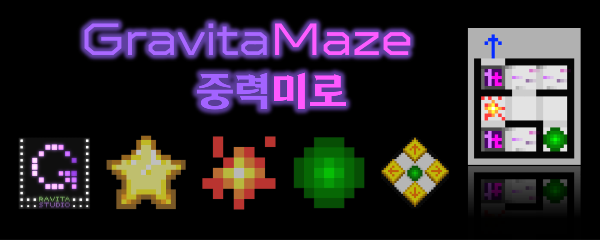

# GravitaMaze

  

  
  
  

## Introduction

### "Escape complex mazes by manipulating gravity!"

* Puzzle game
* Make your own map by using the Map Editor.
* English and Korean are fully available!
* This is a pre-release.
  * 2023 H2 release! Coming soon!
* Check out our latest news below.
  * Youtube: https://youtube.com/@Ravita_Studio/
  * Fantrie: https://fantrie.com/ravitastudio/

## Download

### [v1.4.1 for Android, Windows, and macOS](https://github.com/salt26/gravita-maze/releases/tag/v1.4.1)

---

## Update Logs

Click here to expand or collapse the old update logs!

### Updates (v1.4.0 -> v1.4.1)

* Localization (English and Korean)
* Change fonts.
* Add Settings scene.
* Improve Tutorial mode.
* Improve UI/UX.
* Add several Training and Custom maps.
* Expand the size of the four types of gravity manipulation buttons again.
* Fix some bugs.

### Updates (v1.3.1 -> v1.4.0)

#### Sound

* Add various sound effects
* Add background music for editor scene

#### Considerations for First-time Users

* Add a first-time user scene that allows users to start the tutorial immediately after installing the app.
  * Skip is also available.
* Provide a detailed tutorial tooltip.
* Minor changes in tutorial maps

#### Add New Modes

* Add Custom mode
  * You can play by selecting the map you want.
  * From now, you don't need to enter editor mode to play custom maps.
  * For each map, record the number of attempts until the first time you clear it and keep it stuffed semi-permanently.
* Add Training mode
  * You can practice by type of gimmicks.
  * For each map, record the number of attempts until the first time you clear it and keep it stuffed semi-permanently.
* Add credit scene

#### Giving a Sense of Accomplishment and Motivation

* Reorganize result UI of Tutorial and Adventure mode with some animations and SFXs.
* Add star system
  * If you clear the Tutorial, you will receive three stars.
  * If you clear one of the four Adventure levels, you will receive stars differently depending on the number of lives left.
  * In the mode selection scene and the adventure level selection scene, you can see the highest number of stars acquired at each level. It remains after restarting or updating the app.
* Add series of map system to Adventure mode
  * You can experience various maps than before.
  * It increases the life of a repeat play.
* Add 'God' difficulty to custom mode
  * Maps that require 20 to 50 tries or more for an expert player.
* Add new maps and adjust map balance

#### Improving convenience and user experience

* Expand the size of the four types of gravity manipulation buttons.
* All the letters of iron were changed to bright colors overall.
* In the mode selection scene and the adventure level selection scene, maps are reorganized so that there is no need to press the retry button.
* Reorganize menu UI displayed when game is paused in Tutorial, Adventure, Custom and Training mode.
  * Background volume and sound effects volume can be adjusted from the Pause menu.
  * You can skip the map (make remaining time to zero) from the Pause menu.
* Change the folder name so that map folders appear in ascending order for difficulty in Custom mode.
* Change the image and add animation of the portal.

### Updates (v1.3.0 -> v1.3.1)

#### Common

* In any game play mode,
  * Time pauses when the ball dies or the retry button is pressed. Time starts to go by again when you press any gravity manipulation buttons.
  * The timer UI changes color to pink while the time is paused. Its color turns purple while the time goes by.
  * When a ball escapes, it is shown an animation that moves slowly by gravity.
* Add a new BGM for the game play scenes (Tutorial, Adventure and Test phase in Editor).
* In Adventure mode,
  * Huge scale of map balance patch is done.
    * Easy: 5 maps are replaced, and the time limit of a map is changed.
    * Normal: 7 maps are replaced.
    * Hard: 5 maps are replaced.
    * Insane: 7 maps are replaced.
  * Maps with shutters can also appear in adventure mode.
* You can enjoy some new maps (including shutters) in the editor that are not in adventure mode.
  * If you are using Android, please download `GravitaMaze.zip` and unzip it in root directory(`Internal storage`) using "My Files" app.
  * If you are using macOS, please download `GravitaMaze.zip`, unzip it, and move `Maps` folder to the root directory of `GravitaMaze.app`.

#### Android

* The continuous integration(CI) targets Android API level to 28. (Android 9.0 'Pie')
  * This is because there are issues related to storage read/write permission when the target API level is 29 or higher.

### Updates (v.1.2.1 -> v1.3.0)

#### Common

* The Shutter has added!
  * Until the ball passes, the shutter is the same as no wall.
  * Once a ball passes, the shutter is treated as a wall.
* Add a BGM for the main scene.
* In Tutorial mode,
  * Two maps are added, including shutters.
* In Editor mode,
  * You can place shutters in your maps.
  * If the folder is empty, show the text "Empty!"
  * Fixed a bug related to the long file name.
  * Fixed a bug related to the scroll bar in the Open or Save UI.
* You can enjoy some maps (including shutters) in the editor that are not in adventure mode.
  * If you are using Android, please download `GravitaMaze.zip` and unzip it in root directory(`Internal storage`) using "My Files" app.
  * If you are using macOS, please  download `GravitaMaze.zip`, unzip it, and move `Maps` folder to the root directory of `GravitaMaze.app`.
* More type of screen resolution is supported.
  * 9:22 is now supported. (Portrait)
* The continuous integration(CI) was added to automatically build for Android, Windows and macOS.

#### Android

* The target API level is set to 28. (Android 9.0 'Pie')
  * This is because there are issues related to storage read/write permission when the target API level is 29 or higher.

### Updates (v.1.1.0 -> v.1.2.1)

#### Common

* In Tutorial mode,
  * The progress is displayed.
  * You can pause and resume the game.
  * When you leave or complete the game, the results window is displayed.
* In Adventure mode,
  * Huge scale of map balance patch is done.
    * Easy: 5 lives, 10 maps to escape, more easier than before!
    * Normal: 5 lives, 10 maps to escape, a little easier than before.
    * Hard: 7 lives, 10 maps to escape
    * Insane: 10 lives, 10 maps to escape, more harder than before!
  * The remaining life and progress are displayed.
  * You can pause and resume the game.
  * When you leave or complete the game, the results window is displayed.
* You can enjoy some maps in the editor that are not in adventure mode.
  * If you are using Android, please download `GravitaMaze.zip` and unzip it in root directory(`Internal storage`) using "My Files" app.
* Many types of screen resolution are supported.
  * 9:16, 9:18, 9:18.5, 9:19, 9:19.5, 9:20, 9:20.5, 9:21 are supported. (Portrait)
  * 3:4 is not supported.

#### Android

* You can press the Back key to press the Pause button in Tutorial and Adventure mode.

#### Windows

* You can press the Enter key to press the Next button in Tutorial and Adventure mode.
* You can press the Esc key to press the Pause button in Tutorial and Adventure mode.

#### macOS

* You can press the Enter key to press the Next button in Tutorial and Adventure mode.
* You can press the Esc key to press the Pause button in Tutorial and Adventure mode.

### Updates (v.1.0.2 -> v.1.1.0)

#### Common

* Adventure mode is now playable!
  * There are Easy, Normal, Hard, and Insane levels.
  * In adventure mode, the map is randomly rotated or flipped.
  * There are five lives given, but they are not displayed in the UI yet.
* Even if you modify the map file(`.txt`) directly to increase the time limit to more than 30 seconds, the maximum time limit is set to 30 seconds.

### Updates (v.1.0.1 -> v.1.0.2)

#### Common

* The default value for the time limit has increased from 10 seconds to 30 seconds.
* Several maps have been added.

#### Android

* Maps can now be saved on internal storage rather than on the app's internal data.
  * You can share your own map or download other's map!
  * The map files are saved in `GravitaMaze/Maps`.

---

## How to Play

### Android

* Click [here](https://github.com/salt26/gravita-maze/releases/tag/v1.4.1)!
* Download `GravitaMaze.v1.4.1.a.zip` on your Android phone, unzip it, and execute `GravitaMaze.apk` to install it.
  * When the `Install unknown app` message appears, choose `Ignore and install`
  * If Google Play Protect shows `Blocked by Play Protect` message, ***DO NOT CLICK OK MESSAGE***. Instead, click `Details -> Install anyway (unsafe)`.
  * `Send app for scanning?` message might appear. You can choose whatever option you want.
  * If you can't download apk file in a browser, grant `Install Unknown Apps` permission to that browser in `Settings - Apps - ... icon - Special Access - Install Unknown Apps`.
  * When you run the app for the first time, you need to allow permission to write to external/internal storage.
    * If you deny permission, the app will not be able to create or load maps.
    * If you checked the `Do not ask me again` option, you must go into the application permission settings and manually turn on the permission for `GravitaMaze`.
* You can download `GravitaMaze.zip` and unzip it in root directory(`Internal storage`) using "My Files" app to enjoy the custom maps.
  * These maps are playable in Custom mode, not in Adventure mode.
* The gravity can be manipulated by touching the four "arrow" buttons.
* Whenever the ball dies, you can touch "retry" button to retry the map.
  * Time stops while the ball is dead.
  * Time passes after you manipulate gravity.
* Escape the ball before the time limit is over.
  * If you time out, you lose one life.

### Windows

* Click [here](https://github.com/salt26/gravita-maze/releases/tag/v1.4.1)!
* Download `GravitaMaze.v1.4.1.w.zip` and unzip it.
* Execute `GravitaMaze.exe`.
* You can download `GravitaMaze.zip` and unzip, and move the `Maps` folder to the root directory of `GravitaMaze.exe` to enjoy the custom maps.
  * These maps are playable in Custom mode, not in Adventure mode.
* The gravity can be manipulated by pressing the four "arrow" buttons.
* Whenever the ball dies, you can press "retry" button (or Space key) to retry the map.
  * Time stops while the ball is dead.
  * Time passes after you manipulate gravity.
* Escape the ball before the time limit is over.
  * If you time out, you lose one life.

### macOS

* Click [here](https://github.com/salt26/gravita-maze/releases/tag/v1.4.1)!
* Download `GravitaMaze.v1.4.1.m.zip` and unzip it.
* Execute `GravitaMaze.app`.
* You can download `GravitaMaze.zip`, unzip it, and move the `Maps` folder to the root directory of `GravitaMaze.app` to enjoy the custom maps.
  * These maps are playable in Custom mode, not in Adventure mode.
* The gravity can be manipulated by pressing the four "arrow" buttons.
* Whenever the ball dies, you can press "retry" button (or Space key) to retry the map.
  * Time stops while the ball is dead.
  * Time passes after you manipulate gravity.
* Escape the ball before the time limit is over.
  * If you time out, you lose one life.

## Map Editor

* You can use the map editor to make your own custom maps!

## Play Modes

* There are a Tutorial mode, four Adventure modes, Custom modes and Training mode.

